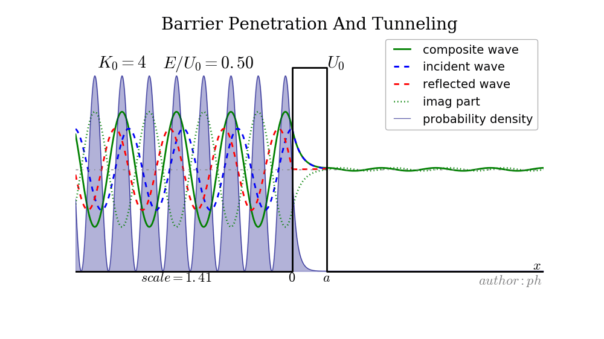
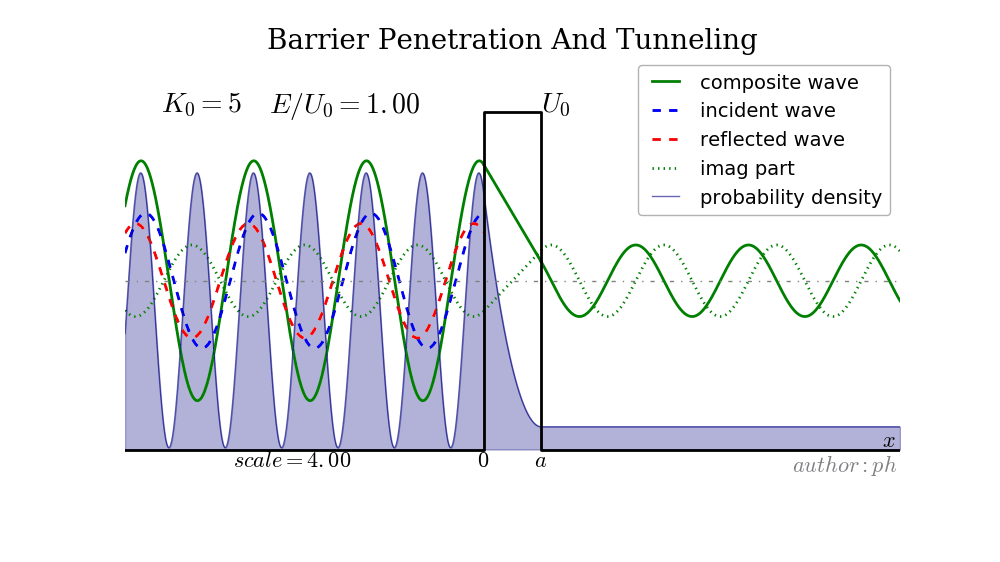
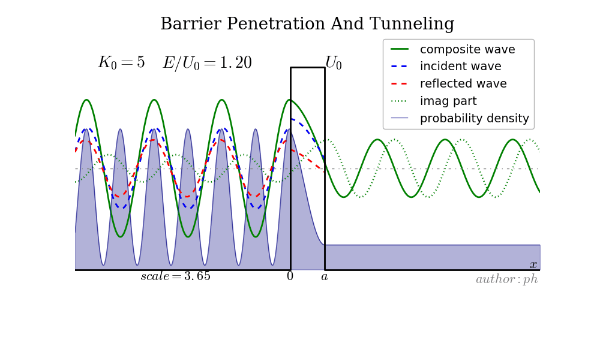

# slgc
- `slgc`,`slgcm` and `slgcd` are code for case of one potential barrier.
- `slgc2*` are code for case of double barriers.
- `slgc3d` is code for 3D view of one barrier.
- `analyse*` are code for analysing.

## Demo
- E/U=0.5
> 
- E/U=1.0
> 
- E/U=1.2
> 